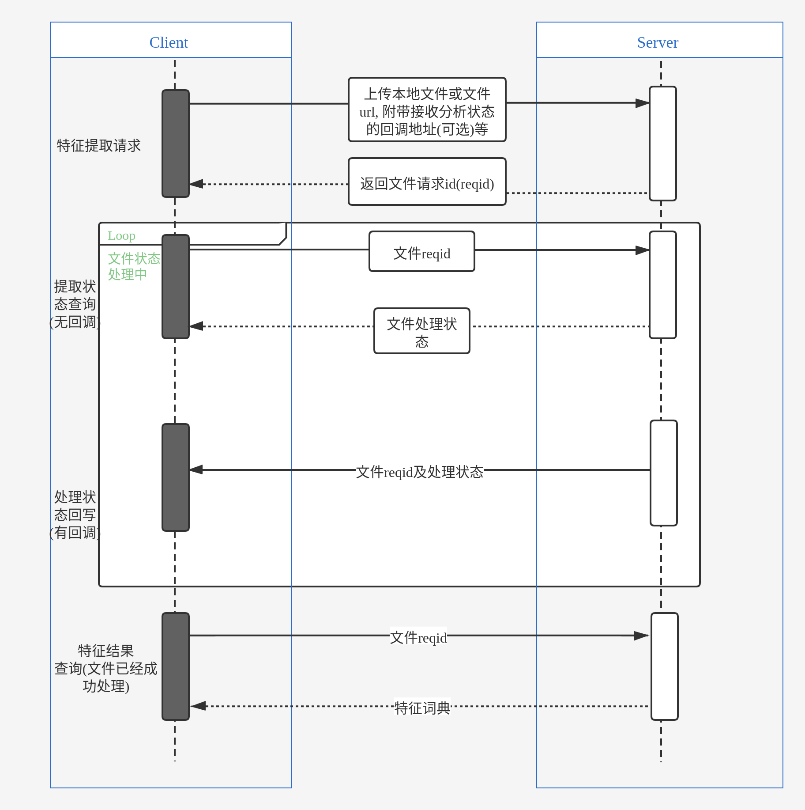

************************************************
接口描述
************************************************

.. contents:: 目录

1. 特征提取接口
======================================

接口描述
======================================

通过异步接口的形式，传入双通道大于8kHz语音，通道信息等，获取从语音中提取出的特征值结果

 使用步骤

1.客户端提交特征提取请求。

正常情况下，服务端返回该请求任务的ID，用以查询识别结果。

2.（可选）客户端轮询查询特征分析状态，或在1的url中查询服务端推送分析成功的状态。
当状态为succeed，表明特征已分析完成，可查询出特征结果。

3.客户端发送特征结果查询请求。

通过步骤1获取的请求ID查询特征提取的结果。

交互流程

1.1. 本地音频请求接口
======================================

1.1.1. 接口功能
--------------------------------------
对于存在客户端本地的文件，传入文件、声道、接收分析状态的url地址（可选）等信息，发起特征提取请求。

1.1.2. 请求方式
--------------------------------------
POST /api/v1/task/upload

1.1.3. 请求参数说明
--------------------------------------
1.1.3.1. 请求头部(HTTP Header)

+--------------+--------------+--------------+----------------------------------------+
|    字段名    |   是否必选   |   数据类型   | 描述                                   |
+==============+==============+==============+========================================+
| dmid         | 是           | String       | 联系DM技术支持获得                     |
+--------------+--------------+--------------+----------------------------------------+

1.1.3.2. 请求体(multipart/form-data)

+-----------------+---------------+---------------+-----------------------------------------------------------------------------------------+
| 字段名          | 是否必选      | 数据类型      | 描述                                                                                    |
+=================+===============+===============+=========================================================================================+
| audio           | 是            | file          | 音频文件                                                                                |
+-----------------+---------------+---------------+-----------------------------------------------------------------------------------------+
| service_channel | 否            | String        | 客服语音的声道, 支持"left"和"right", 默认"left", 表示客服声音在左声道, 客户声音在右声道 |
+-----------------+---------------+---------------+-----------------------------------------------------------------------------------------+
| callback_url    | 否            | String        | 音频分析任务结果状态推送url, 推送Success或者Failure, 不传表示不需要推送分析结果状态     |
+-----------------+---------------+---------------+-----------------------------------------------------------------------------------------+

1.1.4. 正确请求示例
--------------------------------------
.. code-block::

    Header:
    {
        "dmid": "xxx",
        "Content-Type": "multipart/form-data"
    }
    -----------------------------------------------------------------------
    Body:
    {
        "audio": "audio file",
        "service_channel": "left",
        "callback_url": "http://xxx/api/v1/status"
    }

1.1.5. 返回数据说明(Content-type: JSON)
------------------------------------------------------------------

+---------------+---------------------+---------------+--------------------------------------------------------+
| 字段名        | 是否必选            | 数据类型      | 说明                                                   |
+===============+=====================+===============+========================================================+
| code          | 是                  | Int           | code为0时, 业务正常, code不为0时, 业务出错             |
+---------------+---------------------+---------------+--------------------------------------------------------+
| data          | 是                  | JSONObject    | 具体的返回数据(见data字段说明)                         |
+---------------+---------------------+---------------+--------------------------------------------------------+
| msg           | 是                  | String        | 业务运行辅助定位信息                                   |
+---------------+---------------------+---------------+--------------------------------------------------------+

data字段说明

+---------------+---------------+--------------------------------------------------------+
| 字段名        | 数据类型      | 说明                                                   |
+===============+===============+========================================================+
| reqid         | String        | 请求id                                                 |
+---------------+---------------+--------------------------------------------------------+

1.1.6. 正确返回示例
--------------------------------------
.. code-block::

    {
        "code": 0,
        "data": {
            "reqid": "fbzvepj0rrpwkbPhm9CuhIe6jtiCD"
        },
        "msg": "OK"
    }

1.1.7. 错误返回示例
--------------------------------------
.. code-block::

    {
        "code": 401,
        "data": {},
        "msg": "Unauthorized"
    }

1.1.8. 错误码
--------------------------------------
+----------+------------------------------------------------+------------------------+
| 错误码   | 说明                                           | 修复方法               |
+==========+================================================+========================+
| 401      | 鉴权失败                                       | 联系DM技术支持获取dmid |
+----------+------------------------------------------------+------------------------+

1.1.9. 异步状态推送数据说明(Content-type: JSON)
------------------------------------------------------------------
+---------------+---------------+--------------------------------------------------------+
| 字段名        | 数据类型      | 说明                                                   |
+===============+===============+========================================================+
| code          | Int           | 信息码                                                 |
+---------------+---------------+--------------------------------------------------------+
| msg           | String        | 辅助信息                                               |
+---------------+---------------+--------------------------------------------------------+
| reqid         | String        | 请求id                                                 |
+---------------+---------------+--------------------------------------------------------+
| status        | String        | 推送状态: Success或者Failure                           |
+---------------+---------------+--------------------------------------------------------+

1.2. 通过文件url请求接口
======================================
1.2.1. 接口功能
--------------------------------------
对于非本地文件，传入文件url、声道、接收分析状态的url地址（可选）等信息，发起特征提取请求。

1.2.2. 请求方式
--------------------------------------
POST /api/v1/task/analyze

1.2.3. 请求参数说明
--------------------------------------
1.2.3.1. 请求头部(HTTP Header)

+--------------+--------------+--------------+----------------------------------------+
|    字段名    |   是否必选   |   数据类型   | 描述                                   |
+==============+==============+==============+========================================+
| dmid         | 是           | String       | 联系DM技术支持获得                     |
+--------------+--------------+--------------+----------------------------------------+

1.2.3.2. 请求体(application/json)

+-----------------+---------------+---------------+-----------------------------------------------------------------------------------------+
| 字段名          | 是否必选      | 数据类型      | 描述                                                                                    |
+=================+===============+===============+=========================================================================================+
| audio_url       | 是            | String        | 音频文件url地址                                                                         |
+-----------------+---------------+---------------+-----------------------------------------------------------------------------------------+
| service_channel | 否            | String        | 客服语音的声道, 支持"left"和"right", 默认"left", 表示客服声音在左声道, 客户声音在右声道 |
+-----------------+---------------+---------------+-----------------------------------------------------------------------------------------+
| callback_url    | 否            | String        | 音频分析任务结果状态推送url, 推送Success或者Failure, 不传表示不需要推送分析结果状态     |
+-----------------+---------------+---------------+-----------------------------------------------------------------------------------------+

1.2.4. 正确请求示例
--------------------------------------
.. code-block::

    Header:
    {
        "dmid": "xxx",
        "Content-Type": "application/json"
    }
    -----------------------------------------------------------------------
    Body:
    {
        "audio_url": "http://xxx/demo.wav",
        "service_channel": "left",
        "callback_url": "http://xxx/api/v1/status"
    }

1.2.5. 返回数据说明(Content-type: JSON)
------------------------------------------------------------------

+---------------+---------------------+---------------+--------------------------------------------------------+
| 字段名        | 是否必选            | 数据类型      | 说明                                                   |
+===============+=====================+===============+========================================================+
| code          | 是                  | Int           | code为0时, 业务正常, code不为0时, 业务出错             |
+---------------+---------------------+---------------+--------------------------------------------------------+
| data          | 是                  | JSONObject    | 具体的返回数据(见data字段说明)                         |
+---------------+---------------------+---------------+--------------------------------------------------------+
| msg           | 是                  | String        | 业务运行辅助定位信息                                   |
+---------------+---------------------+---------------+--------------------------------------------------------+

data字段说明

+---------------+---------------+--------------------------------------------------------+
| 字段名        | 数据类型      | 说明                                                   |
+===============+===============+========================================================+
| reqid         | String        | 请求id                                                 |
+---------------+---------------+--------------------------------------------------------+

1.2.6. 正确返回示例
--------------------------------------
.. code-block::

    {
        "code": 0,
        "data": {
            "reqid": "fbzvepj0rrpwkbPhm9CuhIe6jtiCD"
        },
        "msg": "OK"
    }

1.2.7. 错误返回示例
--------------------------------------
.. code-block::

    {
        "code": 401,
        "data": {},
        "msg": "Unauthorized"
    }

1.2.8. 错误码
--------------------------------------
+----------+------------------------------------------------+------------------------+
| 错误码   | 说明                                           | 修复方法               |
+==========+================================================+========================+
| 401      | 鉴权失败                                       | 联系DM技术支持获取dmid |
+----------+------------------------------------------------+------------------------+

1.2.9. 状态推送数据说明(Content-type: JSON)
------------------------------------------------------------------
+---------------+---------------+--------------------------------------------------------+
| 字段名        | 数据类型      | 说明                                                   |
+===============+===============+========================================================+
| code          | Int           | 信息码                                                 |
+---------------+---------------+--------------------------------------------------------+
| msg           | String        | 辅助信息                                               |
+---------------+---------------+--------------------------------------------------------+
| reqid         | String        | 请求id                                                 |
+---------------+---------------+--------------------------------------------------------+
| status        | String        | 推送状态: Success或者Failure                           |
+---------------+---------------+--------------------------------------------------------+

2. 提取状态查询接口
======================================
2.1. 接口功能
--------------------------------------
根据请求id，查询对应特征提取任务的状态

2.2. 请求方式
--------------------------------------
GET /api/v1/task/status/{reqid}

2.3. 请求参数说明
--------------------------------------
2.3.1. 请求头部(HTTP Header)

+--------------+--------------+--------------+----------------------------------------+
|    字段名    |   是否必选   |   数据类型   | 描述                                   |
+==============+==============+==============+========================================+
| dmid         | 是           | String       | 联系DM技术支持获得                     |
+--------------+--------------+--------------+----------------------------------------+

2.3.2. 路径参数

+--------------+--------------+--------------+----------------------------------------+
|    字段名    |   是否必选   |   数据类型   | 描述                                   |
+==============+==============+==============+========================================+
| reqid        | 是           | String       | 请求分析时返回的reqid                  |
+--------------+--------------+--------------+----------------------------------------+

2.4. 正确请求示例
--------------------------------------
.. code-block::

    GET /api/v1/task/status/Tfbzvepj0rrpwkbPhm9CuhIe6jtiCDth

2.5. 返回数据说明(Content-type: JSON)
------------------------------------------------------------------

+---------------+---------------------+---------------+--------------------------------------------------------+
| 字段名        | 是否必选            | 数据类型      | 说明                                                   |
+===============+=====================+===============+========================================================+
| code          | 是                  | Int           | code为0时, 业务正常, code不为0时, 业务出错             |
+---------------+---------------------+---------------+--------------------------------------------------------+
| data          | 是                  | JSONObject    | 具体的返回数据(见data字段说明)                         |
+---------------+---------------------+---------------+--------------------------------------------------------+
| msg           | 是                  | String        | 业务运行辅助定位信息                                   |
+---------------+---------------------+---------------+--------------------------------------------------------+

data字段说明

+---------------+---------------+--------------------------------------------------------+
| 字段名        | 数据类型      | 说明                                                   |
+===============+===============+========================================================+
| status        | String        | 处理状态: Success, Failure, Processing                 |
+---------------+---------------+--------------------------------------------------------+

2.6. 正确返回示例
--------------------------------------
.. code-block::

    {
        "code": 0,
        "data": {
            "status": "Success"
        },
        "msg": "OK"
    }

2.7. 错误返回示例
--------------------------------------
.. code-block::

    {
        "code": 401,
        "data": {},
        "msg": "Unauthorized"
    }

2.8. 错误码
--------------------------------------
+----------+------------------------------------------------+------------------------+
| 错误码   | 说明                                           | 修复方法               |
+==========+================================================+========================+
| 401      | 鉴权失败                                       | 联系DM技术支持获取dmid |
+----------+------------------------------------------------+------------------------+

3. 特征结果查询接口
======================================
3.1. 接口功能
--------------------------------------
根据请求id，查询对应音频提取出的特征值结果

3.2. 请求方式
--------------------------------------
GET /api/v1/task/feature/{reqid}

3.3. 请求参数说明
--------------------------------------
3.3.1. 请求头部(HTTP Header)

+--------------+--------------+--------------+----------------------------------------+
|    字段名    |   是否必选   |   数据类型   | 描述                                   |
+==============+==============+==============+========================================+
| dmid         | 是           | String       | 联系DM技术支持获得                     |
+--------------+--------------+--------------+----------------------------------------+

3.3.2. 路径参数

+--------------+--------------+--------------+----------------------------------------+
|    字段名    |   是否必选   |   数据类型   | 描述                                   |
+==============+==============+==============+========================================+
| reqid        | 是           | String       | 请求分析时返回的reqid                  |
+--------------+--------------+--------------+----------------------------------------+

3.4. 正确请求示例
--------------------------------------
.. code-block::

    GET /api/v1/task/feature/Tfbzvepj0rrpwkbPhm9CuhIe6jtiCDth

3.5. 返回数据说明(Content-type: JSON)
------------------------------------------------------------------

+---------------+---------------------+---------------+--------------------------------------------------------+
| 字段名        | 是否必选            | 数据类型      | 说明                                                   |
+===============+=====================+===============+========================================================+
| code          | 是                  | Int           | code为0时, 业务正常, code不为0时, 业务出错             |
+---------------+---------------------+---------------+--------------------------------------------------------+
| data          | 是                  | JSONObject    | 具体的返回数据(见data字段说明)                         |
+---------------+---------------------+---------------+--------------------------------------------------------+
| msg           | 是                  | String        | 业务运行辅助定位信息                                   |
+---------------+---------------------+---------------+--------------------------------------------------------+

data字段说明

+---------------+---------------+--------------------------------------------------------+
| 字段名        | 数据类型      | 说明                                                   |
+===============+===============+========================================================+
| status        | String        | 处理状态: Success, Failure, Processing                 |
+---------------+---------------+--------------------------------------------------------+
| feature       | JSONObject    | 特征字典                                               |
+---------------+---------------+--------------------------------------------------------+

3.6. 正确返回示例
--------------------------------------
.. code-block::

    {
        "code": 0,
        "data": {
            "status": "Success",
            "feature": {
                "feature_1": 0.001,
                "feature_2": 0.001,
                ...
            }
        },
        "msg": "OK"
    }

3.7. 错误返回示例
--------------------------------------
.. code-block::

    {
        "code": 401,
        "data": {},
        "msg": "Unauthorized"
    }

3.8. 错误码
--------------------------------------
+----------+------------------------------------------------+------------------------+
| 错误码   | 说明                                           | 修复方法               |
+==========+================================================+========================+
| 401      | 鉴权失败                                       | 联系DM技术支持获取dmid |
+----------+------------------------------------------------+------------------------+