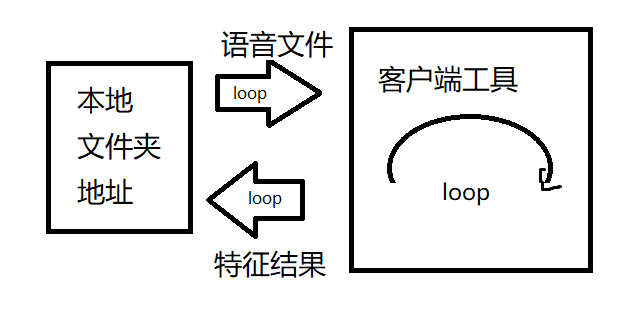
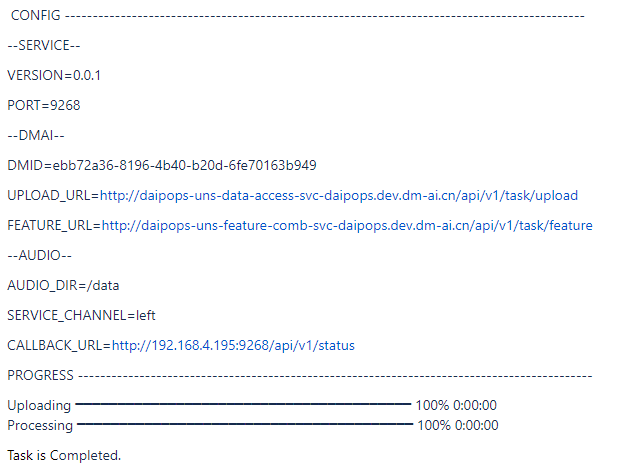
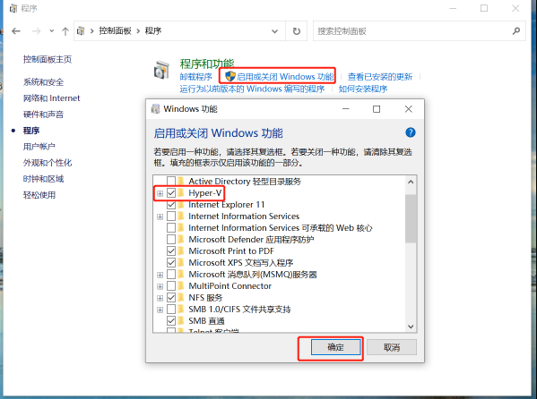
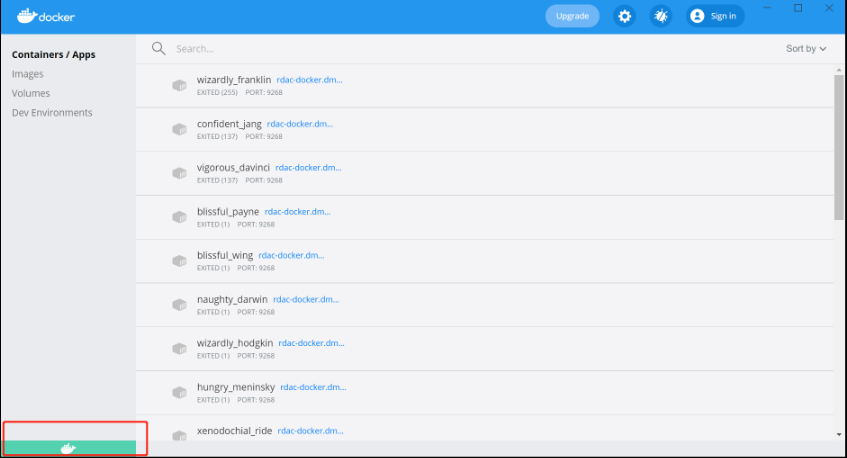

************************************************
客户端工具
************************************************

.. contents:: 目录

工具描述
======================================

为简化客户端代码工作量，也可使用客户端docker镜像工具：配置语音文件所在的路径，启动docker，等待任务完成，即可自动在同一文件路径，获得所有语音的特征结果。

1. Linux环境下的工具使用
======================================

1.1. 下载工具docker镜像
--------------------------------------
docker pull rdac-docker.dm-ai.cn/daipops-uns-extern/daipops-uns-client:1.0.2

1.2. 配置.env文件
--------------------------------------
在Linux命令行下，填入下面内容的各配置项 “xxx”，并存成文件名为“.env”的文件。

1.新建：输入命令: vi .env 后进入.env文件，在该文件中再输入"i"单英文字符进入插入模式(文件左下角出现"-- INSERT --")
   
2.输入内容：填入以下各配置项；按下esc,退出插入模式(文件左下角"-- INSERT --"消失)
  
3.保存：输入:wq 保存为“.env”的文件（在当前目录下，输入ls -a 如果出现了.env文件，则表示保存成功。）
   
4.查看路径：在Linux命令行下输入pwd命令，输出为".env"文件所在的目录路径，该目录路径后续命令会用到.

.env

.. code-block::

    # base
    NAME = daipops-uns-client
    VERSION = 1.0.2
    PORT = 9268
    LOG_LEVEL = INFO

    # dmai
    DMID = xxx
    UPLOAD_URL = http://xxx/api/v1/task/upload
    FEATURE_URL = http://xxx/api/v1/task/feature
    STATUS_URL = http://xxx/api/v1/task/status

    # audio
    AUDIO_DIR = /data
    SERVICE_CHANNEL = xxx
    CALLBACK_URL = http://xxx/api/v1/status

示例

.env

.. code-block::

    # base
    NAME = daipops-uns-client
    VERSION = 1.0.2
    PORT = 9268
    LOG_LEVEL = INFO

    # dmai
    DMID = 6376f604-8bb1-4028-ad46-9495f3270000
    UPLOAD_URL = http://daipops-uns-data-access-svc.dm-ai.com/api/v1/task/upload
    FEATURE_URL = http://daipops-uns-feature-comb-svc.dm-ai.com/api/v1/task/feature
    STATUS_URL = http://daipops-uns-feature-comb-svc.dm-ai.com/api/v1/task/status
    # audio
    AUDIO_DIR = /data
    SERVICE_CHANNEL = left
    CALLBACK_URL = http://192.168.2.223:9268/api/v1/status

1.3. 准备音频文件
--------------------------------------
把音频文件放在同一个目录下, 等待分析

1.4. 启动docker
--------------------------------------
输入命令:
docker run --net=host -it -p xxx:9268 -v .env文件目录路径:/app/env -v 语音目录路径:/data rdac-docker.dm-ai.cn/daipops-uns-extern/daipops-uns-client:1.0.2

其中，配置项如下：

xxx是“.env”文件中CALLBACK_URL配置的端口号，例如9268
yyy是“.env”文件所在目录路径，例如：/home/project/
zzz是语音文件所在路径，例如：/home/project/data

示例

docker run --net=host -it -p 9268:9268 -v .env /home/project:/app/env -v /home/project/data:/data rdac-docker.dm-ai.cn/daipops-uns-extern/daipops-uns-client:1.0.2

执行命令后，会提示配置信息和处理进度。当界面提示”Task is Completed“，所有音频特征提取完成。

1.5. 查看结果
--------------------------------------
在语音目录路径下会生成status.csv文件, 标识每个音频处理任务当前的处理状态。

处理完成的音频会在同一目录下生成一个json文件,json文件名和音频文件名一致, json文件保存对应音频的特征值。

2. Windows环境下的工具使用
======================================

一、环境检查
======================================

1.1 Windows（64 位）版本要求
--------------------------------------
Windows 10 Pro/ Enterprise/ Education（1607 Anniversary Update、Build 14393 或者更新）

查看路径：我电脑右键-属性

1.2 Windows中BIOS设置
--------------------------------------
开机时按F2或F12或DEL或ESC等键（各电脑有所不同），进入BIOS

Configuration➔Intel Virtual Technology（可搜索：“Virtualization”）➔Enabled➔F10保存。

1.3 Windows启用特性
--------------------------------------
控制面板➔程序➔程序和功能➔启用或关闭Windows功能➔勾选Hyper-V、容器

1.4 下载安装dockerdesktop
--------------------------------------
登录后，设置Experimental Features 的值，由False修改成true

  
二、    使用客户端工具
======================================

2.1 启动Dockerdesktop
--------------------------------------
确认Dockerdesktop状态为running

2.2下载工具docker镜像
--------------------------------------

右键单击开始菜单, 选择Windows PowerShell管理员，执行命令

docker pull rdac-docker.dm-ai.cn/daipops-uns-extern/daipops-uns-client:1.0.2 # 拉镜像

2.3. 配置.env文件
--------------------------------------
在以下内容中，填入各配置项 “xxx”，并将内容保存成文件名为“.env”的文件

.. code-block::

    # base
    NAME = daipops-uns-client
    VERSION = 1.0.2
    PORT = 9268
    LOG_LEVEL = INFO

    # dmai
    DMID = xxx
    UPLOAD_URL = http://xxx/api/v1/task/upload
    FEATURE_URL = http://xxx/api/v1/task/feature
    STATUS_URL = http://xxx/api/v1/task/status
    # audio
    AUDIO_DIR = /data
    SERVICE_CHANNEL = xxx
    CALLBACK_URL = http://xxx/api/v1/status

示例

.. code-block::

    # base
    NAME = daipops-uns-client
    VERSION = 1.0.2
    PORT = 9268
    LOG_LEVEL = INFO

    # dmai
    DMID = 6376f604-8bb1-4028-ad46-9495f327000
    UPLOAD_URL = http://daipops-uns-data-access-svc.dm-ai.com/api/v1/task/upload
    FEATURE_URL = http://daipops-uns-feature-comb-svc.dm-ai.com/api/v1/task/feature
    STATUS_URL = http://daipops-uns-feature-comb-svc.dm-ai.com/api/v1/task/status
    # audio
    AUDIO_DIR = /data
    SERVICE_CHANNEL = left
    CALLBACK_URL = http://192.168.2.223:9268/api/v1/status

2.4. 准备音频文件
--------------------------------------
将音频文件放在同一个文件夹中，暂不支持多层文件夹

2.5. 启动docker
--------------------------------------
执行命令：

docker run --net=host -it -p xxx:9268 -v .env yyy:/app/env -v zzz:/data rdac-docker.dm-ai.cn/daipops-uns-extern/daipops-uns-client:1.0.2
其中，配置项如下：

xxx是“.env”文件中CALLBACK_URL配置的端口号，例如9268
yyy是“.env”文件所在目录路径，例如：C:\Users\Desktop\新建文件夹
zzz是语音文件所在路径，例如：C:\Users\Desktop\新建文件夹\data

示例

docker run --net=host -it -p 9268:9268 -v .env C:\Users\Desktop\新建文件夹:/app/env -v C:\Users\Desktop\新建文件夹\data:/data rdac-docker.dm-ai.cn/daipops-uns-extern/daipops-uns-client:1.0.2

执行命令后，会提示配置信息和处理进度。当界面提示”Task is Completed“，所有音频特征提取完成。

2.6 查看分析结果
--------------------------------------
在语音目录路径下会生成status.csv文件, 标识每个音频处理任务当前的处理状态。

处理完成的音频会在同一目录下生成一个json文件, json文件名和音频文件名一致, json文件保存对应音频的特征值

2.7 注意事项
--------------------------------------
windows环境中，docker运行过程下，status.csv文件不建议直接打开，可复制查看

文件路径不能有 中文字符‘—’或者’——‘

